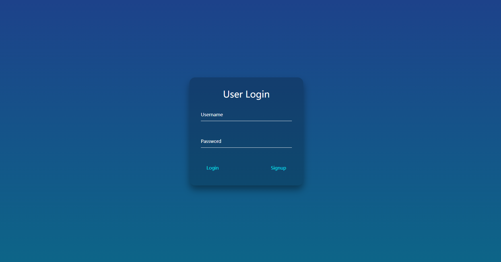
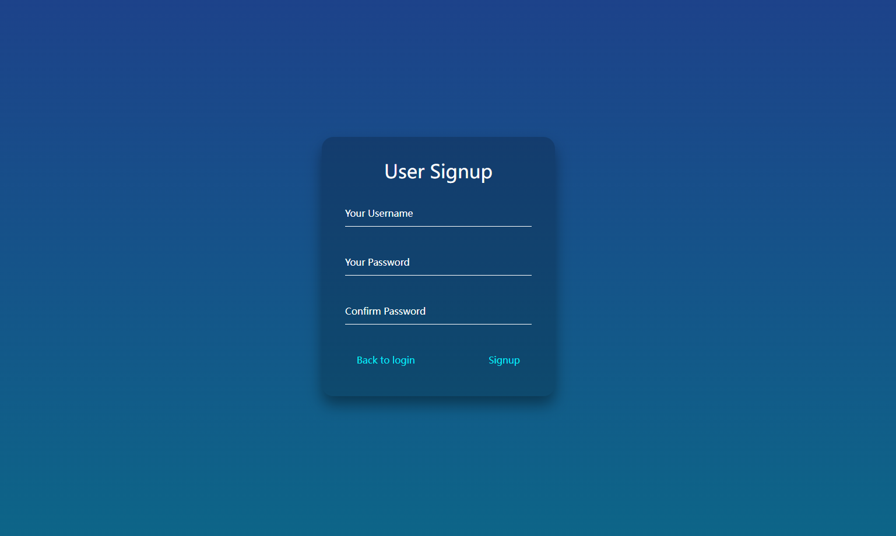
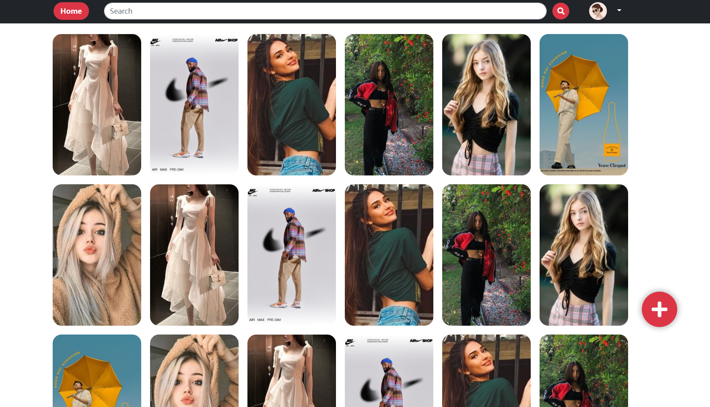
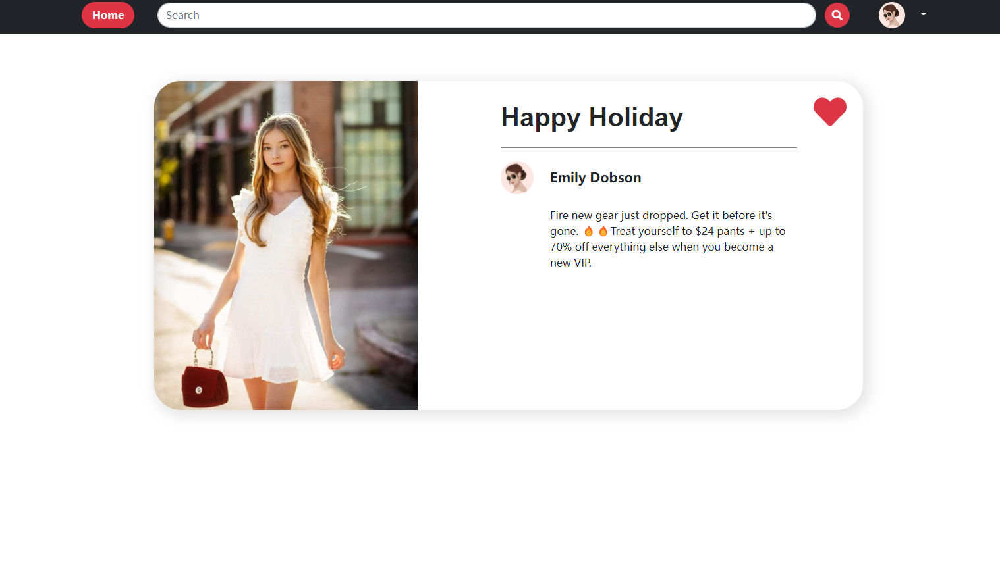
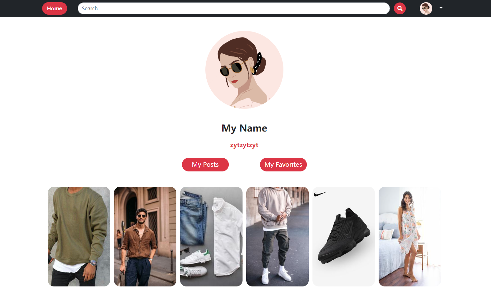
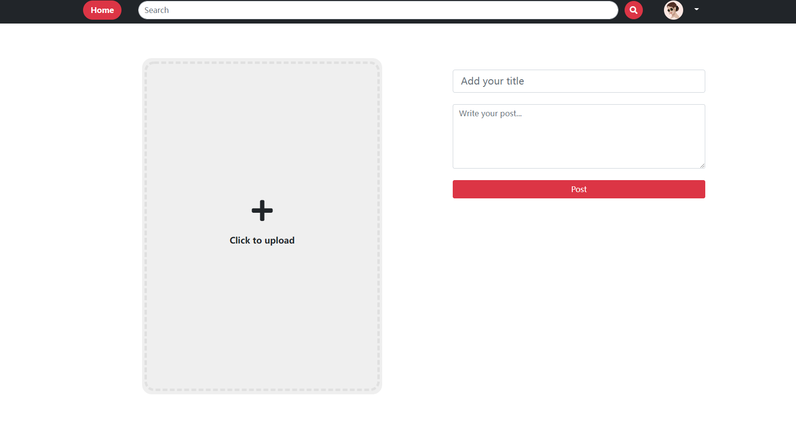
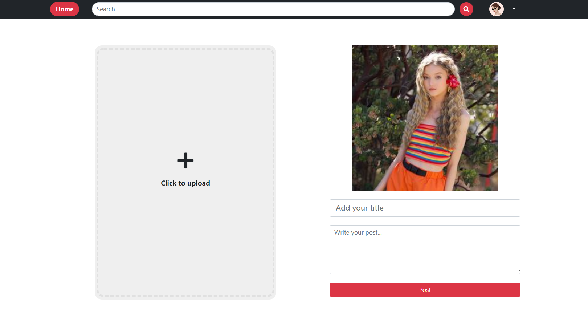

# photo-sharing-platform

After cloning, you should firstly go to the frontend path by 

`cd photo-sharing-platform`

Then run the following code to install modules

`npm install`

Now you can start the web by running

`npm start`

## 1. pages router

1. /login
2. /signup
3. /main
4. /post
5. userInfo
6. /imgDetail

```react
<Routes>
    <Route path="/login" element={<Login />}></Route>
    <Route path="/signup" element={<Signup />}></Route>
    <Route path="/main" element={<Main />}></Route>
    <Route path="/post" element={<Post />}></Route>
    <Route path="/userInfo" element={<UserInfo />}></Route>
    <Route path="/imgDetail" element={<ImgDetail />}></Route>
    <Route path="/" element={<Navigate replace to="/login" />} />
</Routes>
```


## 2. Interfaces

### login



### signup



### main



### imgDetail



### userInfo



### post





For more details about our project, please refer to [here](https://github.com/LegenQS/photo-share-platform/blob/main/Project%20Report.pdf).
